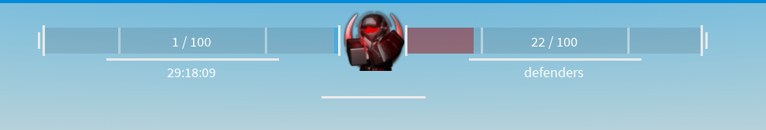
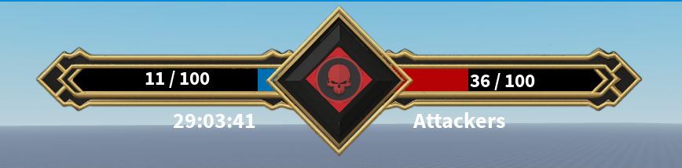

import Metatags from '@site/src/components/Metatags';

<Metatags/>

Here's a list of pre-built addons reasdy to use in your game.

See [this guide](./Guides/Advanced/Addons#installing-addons) for more information on how to install an addon

## [Reset leaderboard on start](https://create.roblox.com/store/asset/111610013059902)
Resets `NumberValues` and `IntValues` in the leaderstats folder on terminal start

## [Respawn players on start](https://create.roblox.com/store/asset/91476807453681)
Respawns players in the playing teams on terminal start using `Player:LoadCharacter()`

## [Change part's color on state change](https://create.roblox.com/store/asset/112231468759111)
Changes the color of a part when the terminal's state changes, useful for visual feedback

## [Hardpoint mode](https://create.roblox.com/store/asset/71150261319290)
Switches the terminal part after a period of time.
:::note[Instalation]
Configuration is done inside the addon module script
:::
---

## [Zetsu's UI](https://create.roblox.com/store/asset/95434741405804)
Zetsu's terminal UI reimplemented as an addon for this terminal
:::note[Instalation]
To install UI addons, make sure you are not loading the default one (remove `wrapper:AddAddon(wrapper.defaultAddons.UI)` in the server)
:::

## [Black and gold UI](https://create.roblox.com/store/asset/112803206113931)
:::note[Instalation]
To install UI addons, make sure you are not loading the default one (remove `wrapper:AddAddon(wrapper.defaultAddons.UI)` in the server)
:::

---

## [UI Boilerplate](https://create.roblox.com/store/asset/140022108861968)
A boilerplate for creating your own UI addons, it contains a basic UI and a module script to handle the UI logic.