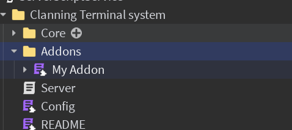

import Tabs from '@theme/Tabs';
import TabItem from '@theme/TabItem';
import Metatags from '@site/src/components/Metatags';

<Metatags/>

:::note[About this guide]
**Difficulty**: <span style={{color: '#f4e380ff'}}>**Medium**</span> <br />
:::

# Addons

Addons are a powerful way to add functionality to the terminal, they are used to create the config panel, ui and start/end screens.

---

## Installing addons

Want to install an addon into your terminal

Follow these steps:

### Insert the addon model into your game

Create an `Addons` folder inside the terminal's main folder if not present and place your addon inside it.
<figure>

<figcaption></figcaption>
</figure>

### Load the addon inside the Server

Add a `:AddAddon()` call in the server script referencing the module:
```lua
wrapper:AddAddon(script.Parent.Addons["My Addon"])
```

:::tip[You're done]
The addon should now be loaded and active.
:::

---

## Creating addons

Addons are defined as modulescripts

### Addon module structure

```lua
local Addon = {}

-- Array of instances that will be placed in game.ReplicatedStorage.Libraries
-- If a duplicate is found, it will be ignored
Addon.Libraries = script.Libraries:GetChildren()

Addon.init = function(wrapper)
    -- Function ran once supplied with the terminal wrapper
end

return Addon
```

:::warning[Editing default addons]
It is **not** recommended to edit the default addons, instead copy them and edit the copy then load the copy instead of the default addon.
:::

## Example

Here is an example of a simple addon that changes a part's color based on ther terminal's state:

<details>
<summary>Code</summary>
```lua
local MapEventAddon = {}

MapEventAddon.Libraries = script.Libraries:GetChildren()

MapEventAddon.init = function(wrapper)
    wrapper.terminal.events.stateChanged.Event:Connect(function(newState)
        local colors = {
            attackers = Color3.new(1, 0, 0.0156863),
            defenders = Color3.new(0.0313725, 0, 1),
            neutral = Color3.new(1, 1, 1),
            locked = Color3.new(0.419608, 0.419608, 0.419608)
        }
    workspace.TERMINALZONE.Color = colors[newState]
    end)
end

return MapEventAddon
```
</details>