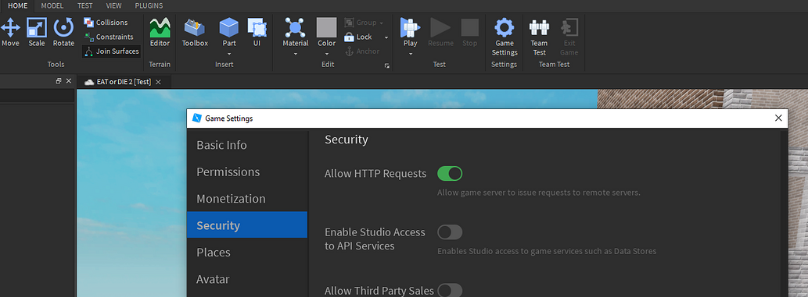

import Tabs from '@theme/Tabs';
import TabItem from '@theme/TabItem';


:::note[About this guide]
**Time to complete**: 1min 30s <br />
**Difficulty**: <span style={{color: '#80f480ff'}}>**Easy**</span> <br />
:::

# Event logging

The terminal has a built-in logging system that allows you to log events in a website.

<figure>

<figcaption>An example of a logged match on the [website](https://terminal.omegadev.xyz)</figcaption>
</figure>

Alternatively, you can send the generated data to a custom API endpoint.

---

## Enabling logging

To prevent abuse, the service requires an **API key** that can be obtained for **free**. To get one, DM `@omega7707` on discord.

:::warning
Make sure HTTP requests are enabled in you game settings

:::

### Add the API key to the config

In the configuration file, scroll down and paste the API key in place of `MY_API_KEY`
```lua {2-2}
onlineReportsEnabled = true,
onlineReportingAPIKey = "MY_API_KEY",
onlineReportingPrivateKey = "MY_PRIVATE_KEY"
```

### Generate a private key

Generate a random string [here](https://www.random.org/strings/?num=1&len=32&digits=on&upperalpha=on&loweralpha=on&unique=on&format=html&rnd=new) and paste it as the private key in place of `MY_PRIVATE_KEY`
```lua {3-3}
onlineReportsEnabled = true,
onlineReportingAPIKey = "MY_API_KEY",
onlineReportingPrivateKey = "MY_PRIVATE_KEY"
```

:::tip[You're done]
Events will start showing up on [terminal.omegadev.xyz](https://terminal.omegadev.xyz)
:::
:::note[Sessions visibility]
Sessions only show when at least 3 players were active and with at least 20 minutes of playtime across players
:::