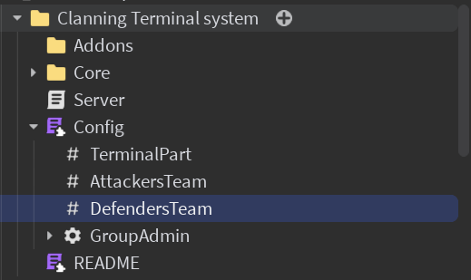
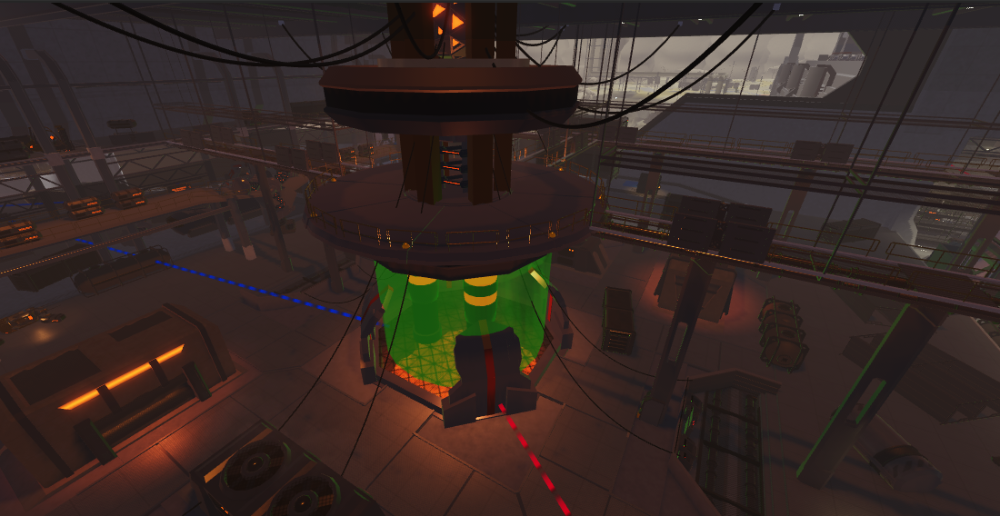
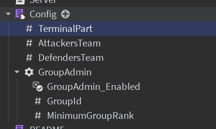

import Tabs from '@theme/Tabs';
import TabItem from '@theme/TabItem';
import Metatags from '@site/src/components/Metatags';

<Metatags/>

:::note[About this guide]
**Time to complete**: 2min <br />
**Difficulty**: <span style={{color: '#80f480ff'}}>**Easy**</span> <br />
:::

# First setup


:::tip[Khol's Admin integration]
It is heavily recommended to use [Khol's Admin](https://kohl.gg/) v0.9.1+ for additionnal features such as logging and permission syncing when using this terminal
:::

## Insert the model
Get the [model](https://create.roblox.com/store/asset/84128149480236) and put it in **ServerScriptService**

## Set basic configuration

<figure>

<figcaption>Open the config modulescript</figcaption>
</figure>

### Edit the teams
Change the teams variables to the teams in your place by selecting the object values then changing the value field in the properties panel.


### Edit the terminal part
Change the terminal part variable to a part reprensenting the **volume** of your terminal

:::warning[Terminal part]

Make sure the terminal part represents a **volume** in wich players will be able to interact with the terminal.
:::

## Set up permissions
<Tabs>
  <TabItem value="usingKhols" label="Using Khol's" default>

    :::tip[You're Done]
    By default anyone with the `admin` role in Khol's Admin will be able to use the terminal.
    :::

    :::note[Changing the required role to access the terminal]
        To change the required role to access the terminal, open the `Config` module script and edit the `MINIMUM_KHOLS_RANK` variable in the `isAdmin` function.

        ```lua showLineNumbers {1-1}
        local MINIMUM_KHOLS_RANK = 3 
        if(shared._K_INTERFACE ~= nil)then
            local rankNumber, rank = shared._K_INTERFACE.Auth.getRank(player.UserId)
		    if(rankNumber >= MINIMUM_KHOLS_RANK)then 
                return true
            end
	    end
        ```

        
        Possible values
        ```
        0	everyone
        1	vip
        2	mod
        3	admin
        4	superadmin
        inf	creator
        ```

    :::
  </TabItem>
  <TabItem value="groupPermissions" label="Group Permissions">
    :::note
    Group permissions are prebuilt into the system for easier configuration
    :::
    

    - Set the value of `GroupAdmin_Enabled` to `true`
    - Set the value of `GroupId` to the ID of your group
    - Set the value of `MinimumGroupRank` to the minimum rank required to use the terminal
  </TabItem>
  <TabItem value="custom" label="Custom">
    :::note
    To add a custom way of checking permission, you can edit the `isAdmin` function in the `Config` module script.

    The function should return `true` if the player is allowed to use the terminal, and `false` otherwise.

    ```lua showLineNumbers {1-1}
    function isAdmin(player)
        if(isAdmin)then  -- Your custom permission logic here
            return true
        end
        return false
    end
    ```
    :::

    :::warning[Caching]
    If using any external service, it is recommended to cache the results from a request as the `isAdmin` function is frequently called
    :::
  </TabItem>
</Tabs>

