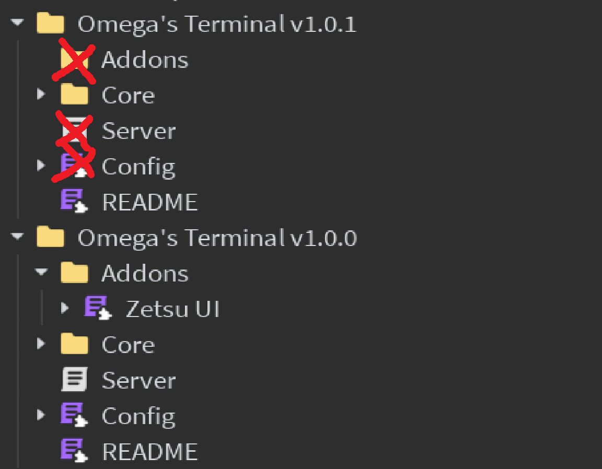

import Tabs from '@theme/Tabs';
import TabItem from '@theme/TabItem';
import Metatags from '@site/src/components/Metatags';

<Metatags/>

:::note[About this guide]
**Time to complete**: 1min 30s  
**Difficulty**: **Easy**  
:::

# Updating the core

:::note[Auto-updating]
For security reasons, the core of the terminal **cannot** be updated automatically. You will have to do it manually.
:::

## Download the latest version
Get the latest version of the terminal from the [roblox asset](https://create.roblox.com/store/asset/84128149480236)

## Delete unwanted files

  <figure>

    <figcaption>Delete the Server, Config and Addons files in the new version</figcaption>
  </figure>

## Replace custom files

  <figure>

    <figcaption>Move the Server, Config and Addons files 
from the old version to the new version</figcaption>
  </figure>

:::tip[You're done]
 You can now use the new version of the terminal!
:::