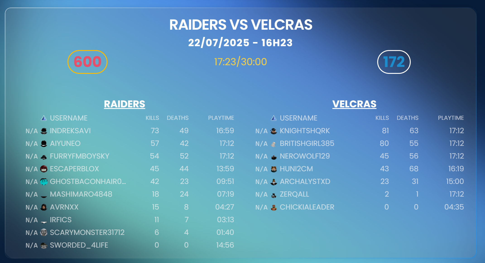

import clsx from 'clsx';
import Link from '@docusaurus/Link';
import useDocusaurusContext from '@docusaurus/useDocusaurusContext';
import Layout from '@theme/Layout';
import HomepageFeatures from '@site/src/components/HomepageFeatures';

import Heading from '@theme/Heading';
import styles from './index.module.css';

<h1 style={{fontSize: '5rem', fontWeight: 'bold', textAlign: 'center'}}>Omega's terminal</h1>
<h3 style={{fontSize: '2rem', fontWeight: 'bold', textAlign: 'center'}}> A modern and modular terminal for clanning </h3>

  

    <Link className="button button--secondary button--lg"to="/docs/Guides/Basic/Setup">Installation Tutorial - 3min ⏱️</Link>

  
  

<h1 style={{fontSize: '3rem', fontWeight: 'bold', textAlign: 'center'}}>Features</h1>
    
<h1 style={{fontSize: '2.5rem', fontWeight: 'bold', textAlign: 'center'}}>Continuous point counting and accurate timer</h1>

Points are not counted every second but at much smaller intervals, making sure time captured always translates into points. Time counting is independant of latency.

  
<h1 style={{fontSize: '2.5rem', fontWeight: 'bold', textAlign: 'center'}}>Khol's admin integration</h1>

The terminal is fully integrated with khol's, terminal actions are directly logged inside khol's and permissions can be synced between khol's and terminal admins ! No more hosts complaining of not having perms

  
<h1 style={{fontSize: '2.5rem', fontWeight: 'bold', textAlign: 'center'}}>Fully customizable</h1>

Scripters can customize every aspect of the terminal, from terminal behaviour to UI without diving into the core

  
<h1 style={{fontSize: '2.5rem', fontWeight: 'bold', textAlign: 'center'}}>Built-in logging</h1>

Log every event on a website you can check at anytime for free

